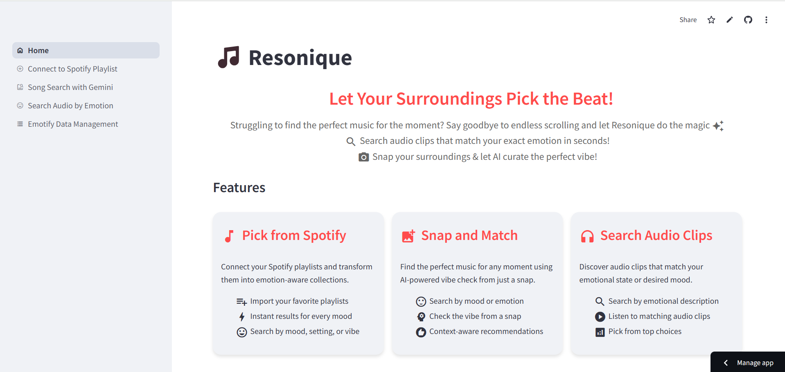
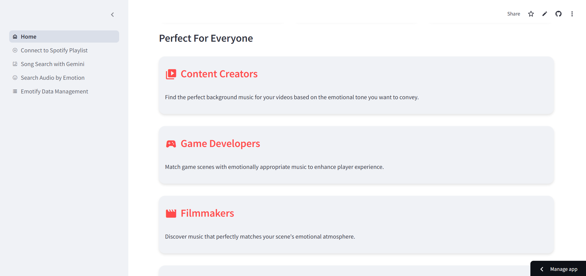
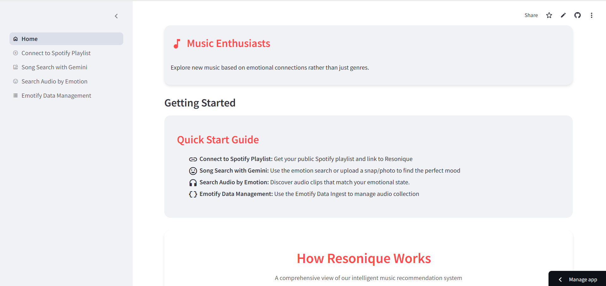
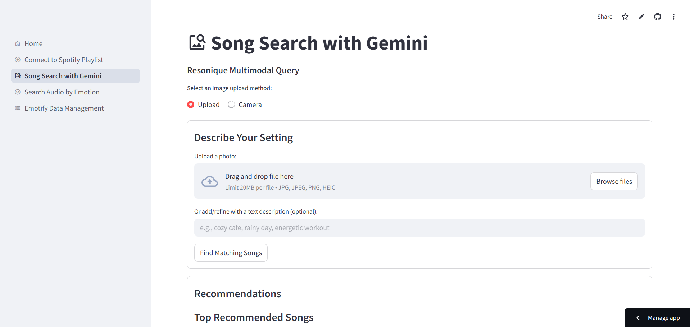

# 🎵 **Resonique**

Intelligent Music Recommendation System  
_Personalized music discovery using AI-powered multimodal search_  
_Retrieve audio clips that match your exact emotion in seconds!_

Checkout the app: https://resonique.streamlit.app/

Understand on Kaggle: https://www.kaggle.com/code/charvik/emotional-audio-search-vector-embeddings-mpnet

## **About Resonique**

In a world of limitless music, finding the right song for your mood can be overwhelming. **Resonique** simplifies this by **understanding your vibe through images, text, or emotions** and delivering the perfect song. Whether you're looking for **relaxing evening tunes, high-energy beats, or immersive soundscapes**, Resonique ensures that music resonates with your emotions.

✨ **Key Features:**

-   **Multimodal Search**: Search for music using images, text descriptions, or direct queries.
-   **AI-Powered Song Discovery**: Uses **Google Gemini AI** to generate descriptions of images and user queries.
-   **Vector-Based Retrieval**: Leverages **Pinecone** for high-speed similarity search on song embeddings.
-   **Emotion-Based Audio Retrieval**: Retrieves emotion-embedded tracks from Pinecone and fetches audio clips from **Supabase**.
-   **Spotify Integration**: Match songs from your Spotify playlists.

## **Components**

The system is divided into **two major flows**:

1. **Multimodal Song Retrieval** 📸

    - **Extracts & Embeds Playlist Data**: Song descriptions are generated with Gemini and stored in **Pinecone Vector DB**.
    - **Gemini AI**: Converts user input (text/image) into meaningful descriptions.
    - **Vector Search**: Retrieves relevant songs based on similarity with the user’s query.

2. **Emotion-Based Audio Retrieval** 🎭
    - **Ingests the Emotify Dataset**: Embeds and uploads audio emotion scores as text embeddings to **Pinecone**.
    - **Emotion Matching**: Uses vector search to find emotion-aligned audio track ids from Pinecone and fetches the audio file from **Supabase**.


## **How Resonique Works (Detailed Flow)**

1. **User Inputs**

    - Upload an **image**, **text description**, or **emotion-based query**.
    - Example: _"Evening calm and relaxing music"_ or an **image of your surroundings**.

2. **Multimodal Processing**

    - **Text/Image Query → Gemini AI**
        - Extracts **descriptions** from images.
    - **Embedding & Vector Search**
        - The description is embedded and matched against the Pinecone vector database.
    - **Spotify Song Retrieval**
        - Fetches matching songs from Spotify using the **closest vector match**.

3. **Emotion-Based Audio Retrieval**

    - The emotion from the query is matched with **emotion text embeddings** and track id's are retrieved from Pinecome for relevant audio tracks.
    - The most **emotionally relevant** audio clips are retrieved from Supabase.

4. **Results & Recommendations**
    - The app displays a **personalized music selection** based on your input.
    - Users can **use the recommendations for a variety of tasks directly** or **add them to their creativity**.

---

## **What You Need to Get Started?**

Before running Resonique, gather the following credentials:

-   **Spotify API**
    -   `SPOTIFY_CLIENT_ID`
    -   `SPOTIFY_CLIENT_SECRET`
-   **Pinecone (Vector Database)**
    -   `PINECONE_INDEX_NAME`
    -   `PINECONE_HOST`
    -   `PINECONE_ENV`
    -   `PINECONE_API_KEY`
    -   `PINECONE_NAMESPACE`
-   **Google Gemini API**
    -   `GEMINI_API_KEY`
-   **Supabase (Cloud Database & Storage)**
    -   `SUPABASE_URL`
    -   `SUPABASE_KEY`
    -   `SUPABASE_BUCKET_NAME`

### **Loading Your Audio Files to Supabase**

To retrieve emotion-tagged audio files, upload your dataset to **Supabase storage**, and set up **Pinecone** for proper metadata is attached for retrieval.

---

## **Steps to Run Locally**

### **1️⃣ Set Up Virtual Environment & Install Dependencies**

```bash
python3 -m venv venv_resonique
source venv/bin/activate  # On Windows: venv_resonique\Scripts\activate
pip install -r requirements.txt
```

### **2️⃣ Configure API Credentials**

Store all necessary API credentials inside `.streamlit/secrets.toml`

```toml
[spotify]
client_id = "your_spotify_client_id"
client_secret = "your_spotify_client_secret"

[pinecone]
index_name = "your_pinecone_index"
host = "your_pinecone_host"
env = "your_pinecone_env"
api_key = "your_pinecone_api_key"
namespace = "your_pinecone_namespace"

[gemini]
api_key = "your_gemini_api_key"

[supabase]
url = "your_supabase_url"
key = "your_supabase_key"
bucket_name = "your_supabase_bucket_name"
```

### **3️⃣ Set Up Pinecone**

-   Create a **Pinecone index** for **spotify song embeddings** and **audio emotion scores embeddings**.
-   Ensure it's configured with **mpnet-base-dot-v1** embedding model with dimention = 768 and cosine similarity.

### **4️⃣ Configure Supabase**

-   Upload your **Emotify audio clips** into Supabase storage.
-   Ensure the dataset is properly structured for querying.

### **5️⃣ Run the Application**

```bash
streamlit run streamlit_app.py
```

## 🌐 **Preview of Resonique**

Here's a quick glimpse of what you can expect on the Resonique web app:









---

## **Future Enhancements**

🔮 **Coming Soon!**

-   **Input audio files in the multimodal AI search for audio analysis and deeper music relevance**.
-   **Match with audio embeddings directly for emotions rather than a labelled dataset**.
-   **User-specific personalization based on history**.
-   **Integration with other Music apps**.

---
